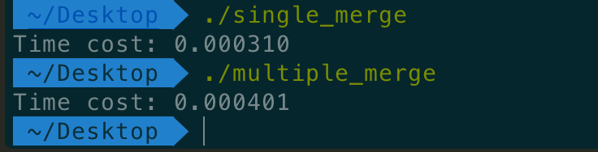
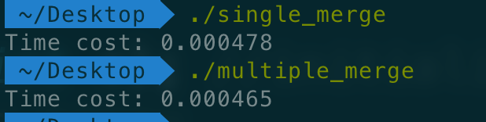

# SUSTech CS302 OS Lab4 Report

#### Title:      Toy CPU                                                  

#### Student: 徐逸飞 11611209

#### Time:    2019/03/12

#### Experimental Environment:   MacOS Mojave                                                      

#### Summit by: Blackboard

### Task：

- Task 1. Implement a multithreading version merge sort in C language.
- Task 2. Finish an analysis report.


### Running Time Analysis：

Array size | Single Thread (second) | Multiple Threads (second) 
:----------: | :-----------: | :----------:
10         | 0.000019 | 0.000197 
100         | 0.000046 | 0.000229 
1000 | 0.000310 | 0.000401 
1500 | 0.000478 |0.000465
1000000 | 0.308995 | 0.102389 


**Array with size 1000:**



**Array with size 1500:**




### Running Time Analysis：

To sort an array whose size is smaller than an special size ***n***, the single-thread is faster because the creation of threads is relatively time-cost.

To sort an array whose size is larger than an special size ***n***, the multithreading is faster because multithreading separates a heavy work into several isolated and smaller part. And the concurrency speeds the execution up.

In my experiment, ***n*** is around 1500.

As for the relationship between the number of threads and overall performance, the number of threads should be limited to a range, 4 in my experiment, to avoid unsatisfying time cost of creation.


### Margin Gain 

The margin gain will decrease with the creation of new threads. Follows are based on an array with a size 1000000. 

The margin gain of using 2 threads instead of a single thread is around **30%** while the margin gain of using 4 threads instead of a single thread is around **50%**.

The idea of using multiple threads is to divide the task into smaller ones and different threads work on isolated tasks. But if there are infinite threads, not only the time cost but also the merging cost is large. Consequently, the margin gain is decrease with the increament of the number of threads.


### Code

Single thread:

```C
#include <stdlib.h>
#include <stdio.h>
#include <pthread.h> 
#include <sys/time.h>

#define MAX 1000000
#define RANDNUM_MAX 999
#define random(x) (rand()%x)

void merge(int *,int,int,int);
void merge_sort(int*,int,int);
void generate_random_array(int *);
void display(int *);


int main()
{
	int i;
	int a[MAX] = {0};
	struct timeval start, end;
	double delta;
	srand((int)time(0));
	
	//mark the start time
	gettimeofday(&start, NULL);

	generate_random_array(a);
	// display(a);
	merge_sort(a,0,MAX-1);
    // display(a);
    //mark the end time
	gettimeofday(&end, NULL);
	delta = ((end.tv_sec  - start.tv_sec) * 1000000u +
         end.tv_usec - start.tv_usec) / 1.e6;

	printf("Time cost: %f\n",delta);
	return 0;
}

void merge(int *p,int low,int mid,int high)
{
	int i,k;
	int* temp = (int*)malloc((high-low+1)*sizeof(int));
	int start1 = low;
	int end1 = mid;
	int start2 = mid+1;
	int end2 = high;

	for (k = 0;start1<=end1 && start2<=end2;k++)
	{
		if (p[start1]<p[start2])
			temp[k] = p[start1++];
		else
			temp[k] = p[start2++];
	}

	while (start1<=end1)
		temp[k++] = p[start1++];

	while (start2<=end2)
		temp[k++] = p[start2++];

	for (i = 0;i<high-low+1;i++)
		p[low+i] = temp[i];

	free(temp);
}


void merge_sort(int*p,int low,int high)
{
	int mid = (low+high)/2;

	if (low <high)
	{
		merge_sort(p,low,mid);
		merge_sort(p,mid+1,high);
		merge(p,low,mid,high);
	}
}

void display(int *p){
	for(int i =0;i<MAX;i++){
		printf("%d ", p[i]);
	}
	printf("\n");
}

void generate_random_array(int *p){
	srand((int)time(0));	
	for (int i = 0; i < MAX; i++) 
        p[i] = random(RANDNUM_MAX);
}
```


Multithreading:

```c
#include <stdlib.h>
#include <stdio.h>
#include <pthread.h> 
#include <sys/time.h>

#define MAX 100000
#define RANDNUM_MAX 999
#define THREAD_MAX 4 // should be defined as 4 to avoid some potential bugs.
#define random(x) (rand()%x)

void merge(int *,int,int,int);
void merge_sort(int *,int,int);
void multi_merge_sort(int *); //the function that should be called by threads
void generate_random_array(int *);
void generate_threads(pthread_t *,int *); //initialize threads
void display(int *); // display the array
int verify(int *); // verify whether the final array is sortedß

int THREAD_COUNTER = 0; 
double offset_unit = (double)MAX / THREAD_MAX;


int main()
{
	struct timeval start, end;
	double delta;
	int a[MAX] = {0};

	// int a[] = {197, 786, 591, 349, 647, 325, 594, 666, 373,  392};
	pthread_t threads[THREAD_MAX]; 

	//mark the start time
	gettimeofday(&start, NULL);

	generate_random_array(a);
	// display(a);

	generate_threads(threads,a);
	// display(a);

	//specific design to satisfy thread 4
    merge(a,0, (int)offset_unit-1, (int)2*offset_unit-1); 
   	// display(a);
    merge(a,(int)2*offset_unit,(int)3*offset_unit-1, (int)(4 * offset_unit - 1)); 
    // display(a);
    merge(a,0, (int)2*offset_unit-1, (int)4*offset_unit-1);
	// display(a);


    //mark the end time
	gettimeofday(&end, NULL);
	delta = ((end.tv_sec  - start.tv_sec) * 1000000u +
         end.tv_usec - start.tv_usec) / 1.e6;

	printf("Time cost: %f\n",delta);

	// return verify(a);
	return 0;
}

void merge(int *p,int low,int mid,int high)
{
	int i,k;
	int* temp = (int*)malloc((high-low+1)*sizeof(int));
	int start1 = low;
	int end1 = mid;
	int start2 = mid+1;
	int end2 = high;

	for (k = 0;start1<=end1 && start2<=end2;k++)
	{
		if (p[start1]<p[start2])
			temp[k] = p[start1++];
		else
			temp[k] = p[start2++];
	}

	while (start1<=end1)
		temp[k++] = p[start1++];

	while (start2<=end2)
		temp[k++] = p[start2++];

	for (i = 0;i<high-low+1;i++)
		p[low+i] = temp[i];

	free(temp);
}

void merge_sort(int*p,int low,int high)
{
	int mid = (low+high)/2;

	if (low <high)
	{
		merge_sort(p,low,mid);
		merge_sort(p,mid+1,high);
		merge(p,low,mid,high);
	}
}

void multi_merge_sort(int *p) 
{ 
    int thread_counter = THREAD_COUNTER++;
    int low = (int)(thread_counter * offset_unit);
    int high = (int)((thread_counter + 1) * offset_unit - 1);
    // printf("%d,%d\n",low,high );
    merge_sort(p,low,high);

}

void display(int *p){
	for(int i =0;i<MAX;i++){
		printf("%d ", p[i]);
	}
	printf("\n");
}

void generate_random_array(int *p){
	srand((int)time(0));	
	for (int i = 0; i < MAX; i++) 
        p[i] = random(RANDNUM_MAX);
}

void generate_threads(pthread_t *threads,int* a){
	for (int i = 0; i < THREAD_MAX; i++) 
        pthread_create(&threads[i], NULL, &multi_merge_sort, (int *)a);

    for (int i = 0; i < 4; i++) 
        pthread_join(threads[i], NULL);
}

int verify(int *p)
{
	if(MAX==1)
		return 0;
	for(int i=1;i<MAX;i++){
		if (p[i-1]>p[i])
			return 1;
	}
	return 0;
}
```


### Conclusion:

I got the idea of how multithreading works and of the limitation of multithreading. Furthermore. because of the feature that multiple threads in the same process share the same heap, it is necessary to make sure that appropriate tasks are distributed to appropriate threads in order to avoid dirty data access.