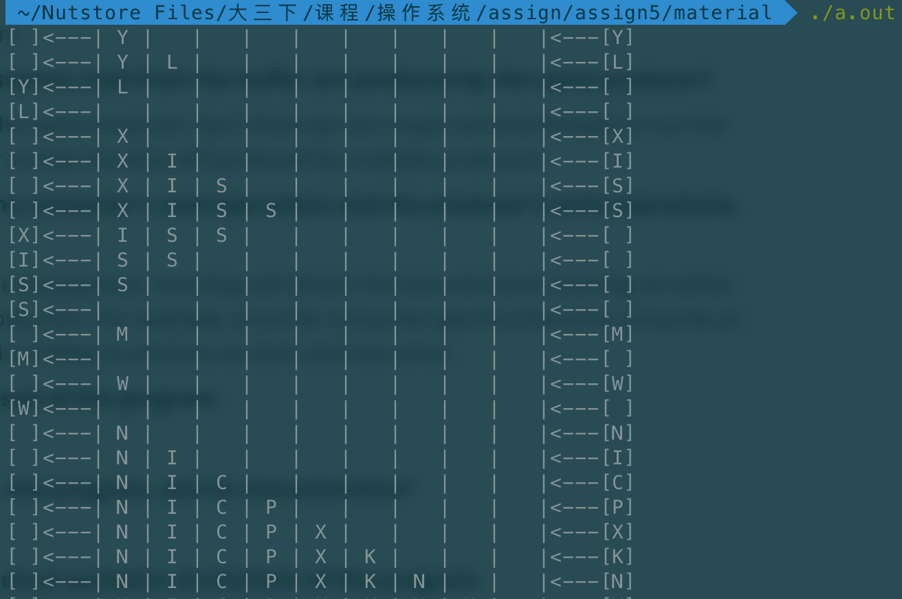

# SUSTech CS302 OS Lab5 Report

#### Title:  **Producer-Consumer Problem**                                                  

#### Student: 徐逸飞 11611209

#### Time:    2019/04/08

#### Experimental Environment:   MacOS Mojave                                                      

#### Summit by: Blackboard


### Task：

- Task 1.Understand the source codes
- Task 2.Edit and modify the source codes


### Experiments:

1. fundamental

   Function of APIs:

   - **pthread_create:** 

     - Prototype :

     ```C
     int pthread_create(pthread_t *thread, const pthread_attr_t *attr,
                               void *(*start_routine) (void *), void *arg);
     ```
     - Description:

       Create a new thread. It starts a new thread in the calling process. The new thread will run **start_routine** and pass **arg** as the argument.

     - Return:

       On successs, it will return 0. Otherwise, it will return the **error** code and the **thread** will be undefined.

     

   - **pthread_join:** 

     - Prototype:

     ```C
     int pthread_join(pthread_t thread, void **retval);
     ```

     - Description:

       Join and wait for the termination of the **thread**. If the thread is already terminated, the function will return immediately. And the exit status of **thread** will be stored in the loctation pointed by **retval**, if retval is not `NULL`. 

     - Return:

       On successs, it will return 0. Otherwise, it will return the **error** code.

     

   - **pthread_mutex_lock:** 

     - Prototype:

     ```C
     int pthread_mutex_lock(pthread_mutex_t *mutex);
     ```

     - Description:

       The current thread will try to get the mutex lock **mutex**. If the lock is already occupied by another thread, the current thread will be blocked until the lock is released.

     - Return

       On success, it will return 0; Otherwise, an error number will be returned.

       

   - **pthread_cond_wait:** 

     - Prototype:

       ```C
       int pthread_cond_wait(pthread_cond_t *cond, pthread_mutex_t *mutex);
       ```

     - Description:

       The **pthread_cond_wait** is used to block on a conditional variable **cond**. If signal **cond** is triggered by other threads, this thread will wake up and acquire the mutex lock **mutex**.

     - Return:


       On successful completion, a value of zero is returned. Otherwise, an error number is returned to indicate the error.

   - **pthread_cond_signal:** 

     - Prototype:

       ```C
       int pthread_cond_signal(pthread_cond_t *cond); 
       ```

     - Description:

       This function will trigger at least one thread blocked by the specific conditional signal **cond**. If multiple threads are blocked due to **cond**, the scheduler( may be the operating system I guess?) will determine the order of candidate threads.

     - Return:

       0 if successful, **error** code otherwise.

       

   - **pthread_mutex_unlock:** 

     - Prototype:

       ```C
       int pthread_mutex_lock(pthread_mutex_t *mutex);
       ```

     - Description:

       The current thread releases the lock **mutex**. If there are other threads blocked by this mutex lock, the scheduler will determine which thread should acquire this mutex lock.

     - Return:

       0 if successful, **error** code otherwise.

       

2. Producer-Consumer Problem

   - **Are the data that consumers read from the buffer are produced by the same producer?** 

     - Yes, they are from the same producer. But I think we can create several threads to run the routine of producer so that the data will produced by multiple producers.

   - **What is the order of the consumer's read operations and the producer's write operations, and their relationship**

     - They share the same pipe(queue). And they will obtain the lock whenever working on either consumption or production. For example, once the consumer get the chance to consume an item, the producer is unlikely to produce an item and vice versa.

   - **Briefly describe the result of the program:**

     - The producer produces one item in an iteration, while the consumer also consumes one item in an iteration. Whenever one of them works, the other is unlikely to do its job. Additional, if the buffer is empty, the consumer sleeps. So does the producer if the buffer is full.

       

     - 

   - **What queue is used in this program, and its characteristics?**

     - A normal queue is used. And it follows the rule that 'first in, first out.'(FIFO) and it has a fixed size.

   - **Briefly describe the mutual exclusion mechanism of this program:** 

     1. Both the consumer and the producer are created with a shared queue and work on two thread separately.

     2. If the consumer get the lock, it will change the turn number to **CONSUMER_TURN**, and vice versa.

     3. The owner of the lock will check the queue.

     4. There are two special cases: the queue is empty and the owner is the consumer; the queue is full and the owner is the producer. As for the case one, the consumer will do nothing. For case two, the producer will do nothing. As for other cases, they will either produce a new item or consume an item.

     5. After finishing, the owner will release the lock and try to acquire the lock in next iteration.

     6. Back to step 2.

        

3. Readers-Writers Problem

   - **What interfaces of semaphore are used in this program?**

     - sem_init
     - sem_post
     - sem_wait

   - **What are these interfaces used for?**

     - sem_init:

       - Prototype:

         ```c
         int sem_init(sem_t *sem, int pshared, unsigned int value);
         ```

       - Description:

         Initialize a new anonymous semaphore stored in **sem** with initial value **value**. If **pshared** is not 0, this semaphore will be shared between processes.

     - sem_post:

       - Prototype:

         ```c
         int sem_post(sem_t *sem);
         ```

       - Description:

         The semaphore stored in **sem** increased by 1. If the value is smaller or equal to 0, the scheduler will choose a blocked thread due to this semaphore to be awake.

     - sem_wait:

       - Prototype:

         ```c
         int sem_wait(sem_t *sem);
         ```

       - Description:

         When calling this function, the value of **sem** will decrease by 1. If the value is less than zero, the current thread will be blocked until another thread posts this semaphore.

         

   - **Can readers read at the same time? Why?**

     - Yes. Because when the line 

     - ```c
       printf("\nReader Inside..%d\n", *buffer);
       ```

       is executing, the semaphore **rc** is not owned by the current thread. The atomic operation does not invoke this line.

       

   - **Can writers write at the same time? Why?**

     - No. When the line

       ```c
       printf ("write ::%d\n", *buffer);
       ```

       is executing, the current writer owns the lock, implemented by a semaphore with initial value 1, so that other writer cannot access the **buffer**.

       

   - **What is the performance of the reader's synchronous reading?**

     - I think it is pretty good. Compared with the original one, it prevents the reader from reading the dirty data when the writer has not finished its writing.

       

   - **After one writer writes, can the next writer write before one reader read? Why?**

     - It depends. If there are no reader waiting for reading the data, the next writer can write successully because no one owns both **db** and **rc** now. If one or more readers are waiting, one reader waiting for **db** owned by the previous writer and the other readers waiting for **rc** owned by the first reader, the writer cannot access buffer because **db** will be occupied by the first reader at first. Then after the last reader finishing its reading, the next writer is able to write.

### Conclusion:

I got the idea of how multithreading works and of how to prevents the conflict between multiple threads by using semaphores and locks. Furthermore, because of the feature of semaphores, we can implement a reader priority mode.