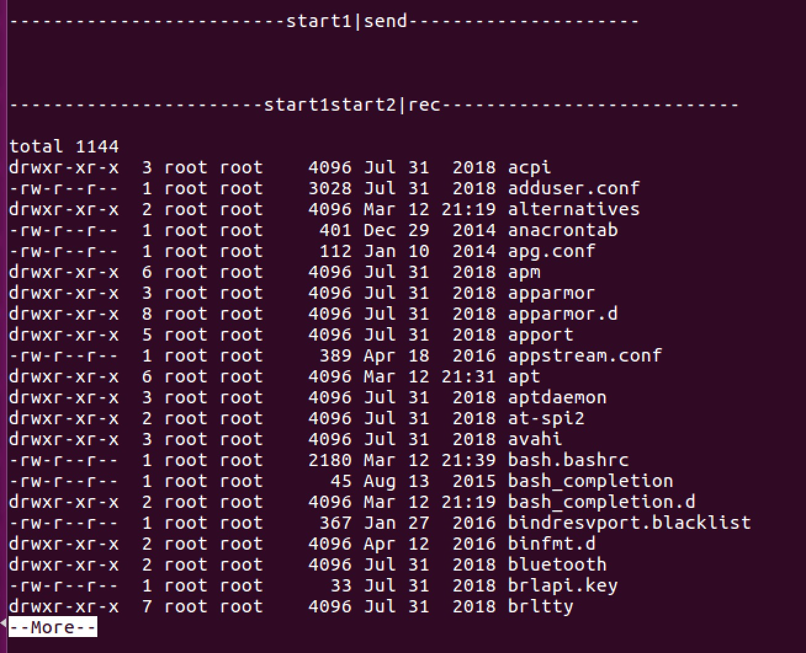
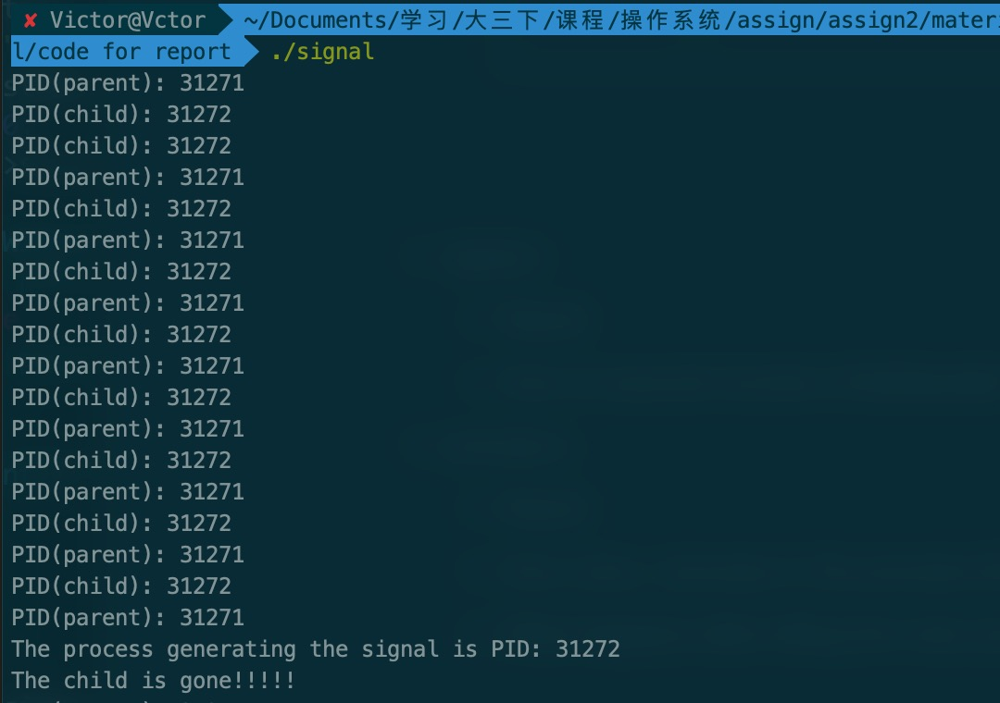
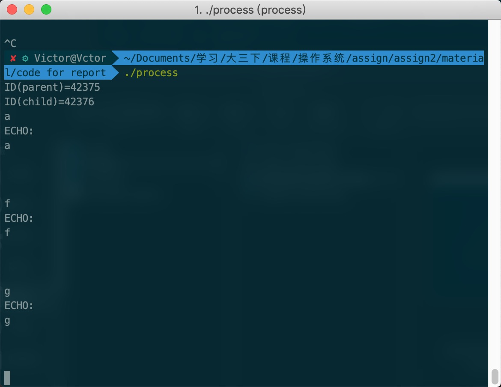

# SUSTech CS302 OS Lab2 Report

#### Title:      Process                                                  

#### Student: 徐逸飞 11611209

#### Time:    2019/03/12

#### Experimental Environment:   Ubuntu 16.04                                                         

#### Deadline: 23:59, 2019-03-13

#### Summit by: Blackboard

### Task：

Task 1. Use the man command to get the manual of fork, exec, wait, exit, pipe               
Task 2. Compile and execute fork.c, observe the results and the process                   
Task 3．Compile and execute pipe.c, observe the results                               
Task 4．Use the man command to get the manual of sigaction, tcsetpgrp, setpgid
Task 5．Compile and execute signal.c, observe the results and the process                 
Task 6．Compile and execute process.c, observe the results and the process                                                                              

###Experiments:

1. ####Fundamental:

  - **What is a system call**: 

    ​    A system call is a way for computer programs, in the user-space, to request a service from the kernel of the operating system. This may include hardware-related services( a disk drive access), creation and execution of a new process( fork()), and communication with intergral kernel services such as processes scheduling.

    

  - **What is fork**:

    ​    ***Fork*** is a system call that causes creation of a new process. The children process is an exact copy of the parent process except **PID**, **PID of the parent process** and so on. In addition, the files that have been already opened in the parent process are able to be modified by the children process, and if the child reads from the file, then the parent's file pointer will also be moved.

    

  - **How to realize inter-process communication**: 

    1. Shared Memory

       - All processes all work on the same cluster of data.

    2. Message passing

       - Message passing systems make workers communicate through a messaging system. Messages keep everyone seperated, so that workers cannot modify each other's data.

         

  - **How to realize inter-process connection**:    

    I think ***inter-process connection*** is the same as ***inter-process communication***. However, from TA's view, students in last semester provided that using pipe was able to realize inter-process connection.

    

2. ####Write the prototype of the following functions:

  - **fork**: 

    *pid_t fork*( **void**);

  - **signal**:

    *void* (*signal(int _sig, void (*_func)(int)))(int);


  - **pipe**:

    *int* pipe(int fd[2]) 

  - **tcsetpgrp**:

    *int* tcsetpgrp(int fildes, pid_t pgid_id);

3. ####Execute and observe

- **fork.c**

  - **Result**:

    

  - How to distinguish between parent and child processes in a program:

    1. the return value of **fork()**.

       ​	parent processes: **PID** of children processes.

       ​	child processes: **0**.

    2. **getppid()** and **getpid()**

       ​	**getppid()** can return the PID of a process's parent and we can campare it with the result of **getpid()**.

- **pipe.c**

  - **Result:** 

    

    

  - **Is execvp(prog2_argv[0], prog2_argv)(Line 56) executed? And why?:**

    It did execute. The main reason is that if this line is not executed, the highlighted word, "--More--", won't occure in the above image.

    

    More Reasons are as follows and are written in comments. 

    ```c 
    if (pid[0])/*父进程内判断为真 进入if*/ 
    	{
    		if ((pid[1]=fork())<0)//再次创建进程 此时pid[1]为父进程的第二个子进程的pid
    		{
    			perror("Fork failed");
    			exit(errno);
    		}
        	//父进程的pid[1]为真 第二个子进程pid[1]为0 所以父进程不进入 第二个子进程进入if
    		if (!pid[1])
    		{
    			close(pipe_fd[1]);
    			dup2(pipe_fd[0],0);/*将管道的读描述符复制给标准输入，然后关闭*/
    			close(pipe_fd[0]);
          		//第二个子进程运行到这出发more的命令
                execvp(prog2_argv[0],prog2_argv); 
    		}else{
    			fprintf(stdout,"\n\n-------------------------%s|send---------------------\n\n",rwBuffer);
    			sprintf(rwBuffer,"start1");
    			write(pipe_fd[1],rwBuffer,strlen(rwBuffer));//将命令写入到管道
    			fprintf(stdout,"\n\n-------------------------%s|send---------------------\n\n",rwBuffer);
    			sprintf(rwBuffer,"start2");
    			write(pipe_fd[1],rwBuffer,strlen(rwBuffer));//将命令写入到管道
    		}
    ```

    

    

- signal.c
  - Result: 
    

  - How to execute function ChildHandler? :

    Use the following command, where 31272 should be the **PID** of the child process.

    ```bash
    kill 31272
    ```

- process.c

  - Result:

    1. Firstly, a command **vi** is executed by the child process.

       

    2. After closing the **vi** window, the parent process continues running the while loop and executes **echo** command.

       

  - **How many ./process in the process list? And what’s the difference between them?:**  

    Two processes. One of them is a parent process, and the other is a child process.

  - **What happens after killing the main process:** 

    The child process stays alive and keeps running.

  - **The process of modifying the source code of *process.c***

    1. When this program starts running, the child process fails in calling **vi** command.

       ```c
       	int cpid;
       	int ppid;
       	char *prog1_argv[2];//using a char array to store the args of command vi
       	char buf[256];
         
       	ppid=getpid();
       	cpid=fork();
         
       	if (cpid<0)
       		exit(-1);
       
       	if (!cpid)
       	{
       		fprintf(stdout,"ID(child)=%d\n",getpid());
       
       		
       		setpgid(ppid,0);
       		tcsetpgrp(0,getpid());
       
       		prog1_argv[0]="vi";/* the args list of command vi */
       		prog1_argv[1]=NULL;
       
       		execvp(prog1_argv[0], prog1_argv);//call vi
       
       		exit(-1);
       	}
       ```

       

    2. After solving the first bug and exiting **vi** command, it is unlikely to go into the while loop.

    ```c
    if (!cpid)
    	{
    		fprintf(stdout,"ID(child)=%d\n",getpid());
    		
    		setpgid(ppid,0); //change setpgid(0,0) to setpgid(ppid,0)
    		tcsetpgrp(0,getpid());
    
    		prog1_argv[0]="vi";
    		prog1_argv[1]=NULL;
    
    		execvp(prog1_argv[0], prog1_argv);
    
    		exit(-1);
    	}
       
    	fprintf(stdout,"ID(parent)=%d\n",ppid);
    
    	// setpgid(cpid,cpid); //comment this line
    	tcsetpgrp(0,cpid);
    	waitpid(cpid,NULL,0); 
    	tcsetpgrp(0,ppid);
    
    ```

    

### Conclusion:

In this assignment, I obtain more knowledge of how to create precessors by **fork()** and  how to do the inter-process communication by **pipe()**. Additionally, I know more about details of suspended processes. 
