# SUSTech CS302 OS Lab4 Report

#### Title:      Toy CPU                                                  

#### Student: 徐逸飞 11611209

#### Time:    2019/03/12

#### Experimental Environment:   MacOS Mojave                                                      

#### Summit by: Blackboard

### Task：

- Task 1. Create a directory named with your studentID and begin the following task.
- Task 2. Find out all bugs in source codes
- Task 3. Modify the source code according to the requirements of the experimental
  instructions, compile and run each program
- Task 4. Observe the results and finish the questions                           

### Experiments:

1. #### Fundamental:

  - **What is a process? What is a program? And what is the difference?**: 

    - A process is a program in execution with its own address space. It is composed of one or more threads and adress space, and contains every accounting information, current pc, accumulated running time, the list of opening files and the page table, of that running program.

    - A program is a executable file. It is typically a cluster of codes or instructions to complete a specific task and is usually stored in the disk. 

    - The difference between them is that a process is a running program with its own address space and a program can invoke multiple processes.

      

  - **What is job? And what is the difference between process and job?**:

    - A job is multiple programs submitted to operating system to achieve some goals.

    - A job invokes multiple programs, which means it also invokes multiple processes. And a process contains its own address space.

      

  - **What are the differences between job scheduling and process scheduling?**

    - Job scheduling is to determine which job should be added in the waiting queue.
    - Process scheduling is to determine which process should be run next.

  

  - **What are the similarities and differences among structures, classes, and unions in C language**

    **The similarities**: 

    - They are all containers to hold any type of data.

    

    **The differences**:

    - Structure:

      - Elements are stored with different address so each member has its own address space.

      - The size of a `struct` is the summation of the size of all members.

      - Members are public by default.

        

    - Union:

      - Elements share the same address space so that if a member is modified,  the other members are cleared.

      - The size of a `union` is the maximum length of its members.

      - Members are public by default.

        

    - Class:

      - Members are private by default.

      - `Class` is pass-by-reference, while the other two data types are pass-by-value, which means classes are created on heap and the other are created on stack.

      - If we use a `struct` as a passed argument, the CPU will copy all members in it, so it is time-cost and space-cost. But when we pass a `class`, it will only copy its reference.

        

2. ####Knowledge

   - **How many states are in a job? And what are they?**

     There are 5 states: 

     1. New : A process is created and has not been added into ready queue yet.
     2. Ready : A process is waiting for being pick up in the ready queue.
     3. Running : A process is executing.
     4.  Waiting : A process is blocked by interruptions or I/O requests.
     5. Termination: A process has already finished its task and exits.

     

   - **What programs are used in this experiment for job control? And their function?**

     Used programs are as follows.

     1. ***scheduler.c***:  

        The main function that imitates the process scheduling of a tiny cpu and create a process for a new job. Set its state to READY and put it in the waiting queue.

        - *schedule:* The flow of the process scheduler's work and it is called per 100 ms.
        - *allocjid:* Allocate a new job id by automatic increment.
        - *updateall:* Update the running time of the current job, the waiting time of waiting jobs and the corresponding priority of each job.
        - *jobselect:* Select a candidate job satisfying the rule that the job with highest priority runs first, if with same priority, the job waiting longest runs first.
        - *jobswitch:* Switch the current job, if needed, to the candidate job.
        - *sig_handler:* Let each signal have the corresponding function call.
        - *do_enq:* Append a new job to the rear of the waiting queue.
        - *do_deq:* Remove the job with the specific job id.
        - *do_stat:* Output the basic information of the running process and waiting processes.
        - *main*: Setup signal handlers, timer and fifo file.

     2. ***stat.c***: 

        Print out the basic information of current running jobs and jobs in waiting queue.

     3. ***enq.c***

        Send a enqueue request to the scheduler and submit a executable job with a specific priority for running.

     4. ***deq.c***

        Send a dequeue request to the scheduler to dequeue the job with a specific job id.

     5. ***job.h***

        Define the data struct of all things.

     6. ***myJob.c***

        To create a job whose running time should larger than 100ms.

        - *delay:* Use busy while to occupy the whole cpu when `myjob` is running.

        - *main:* Call `delay(3)`, delaying 3 seconds.

          

   - **What is used for inter-process communication in this experiment?And its function?**

     Use signals and a temporary fifo file by following steps:

     1. `write()` to write the input command and arguments in the fifo file.

     2. `kill()` to send signals to a process.

     3. `raise()` to setup a signal so that it can be caught by `sig_handle()`.

        

3. #### Question

   - **What should be noted when printing out the job name:**

     The job name is stored in the first element of `char** cmdarg` in **job.h**.

     

   - **Submit a job that takes more than 100 milliseconds to run:**

     I created three kinds of jobs.

     1. busy while

        **Code**

        ```c
        #include <stdio.h>
        #include <time.h>
        
        void delay(int sec)
        {
        	time_t start_time, cur_time; // 变量声明
        	time(&start_time);
        	do {
        		time(&cur_time);
        	} while((cur_time - start_time) < sec );
        }
        
        int main(int argc,char *argv[])
        {
        	delay(3);
        	return 0;
        }
        ```

        

     2. sleep

        **Code**

        ```c
        #include <stdio.h>
        
        int main(int argc,char *argv[])
        {
        	sleep(3);
        	return 0;
        }
        ```

        

     3. delay

        **Code**

        ```c
        #include <stdio.h>
        
        int main(int argc,char *argv[])
        {
        	while(1);
        	return 0;
        }
        ```


   - **List the bugs you found and your fix (code and screenshot)** 

     1. Chinese semicolon(in **updateall()**)

        **Before**

        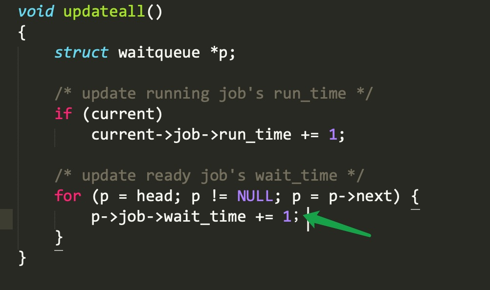

        **After**

        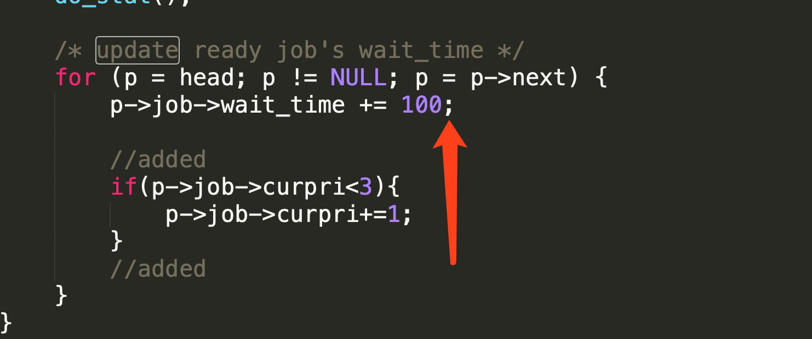

     2. Time slice(in **main()**)

        The time slice should be 100 ms rather than 100 us.

        **Before**

        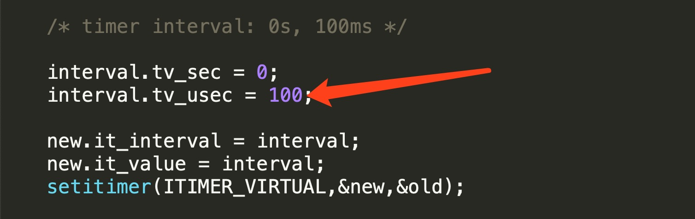

        **After**

        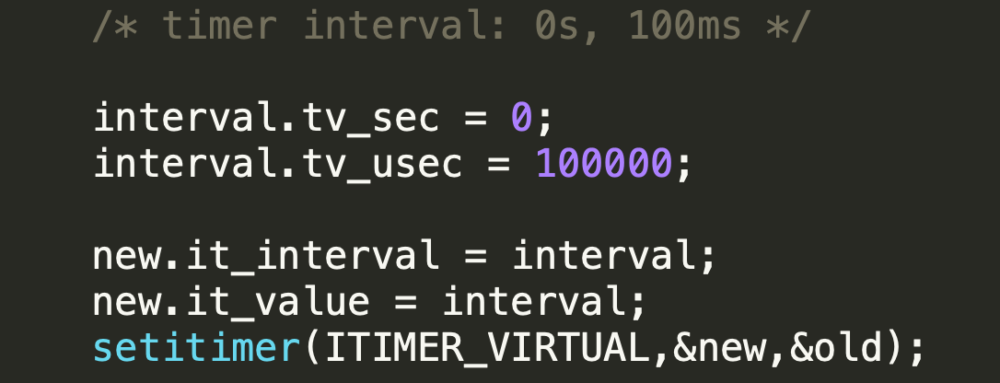

     3. The representation of running time and waiting time(in **updateall()**)

        The time unit should be 1 ms so that it should be changed to 100.

        **Before**

        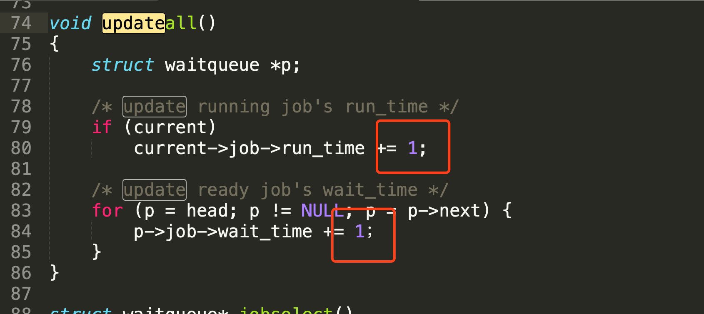

        **After**

        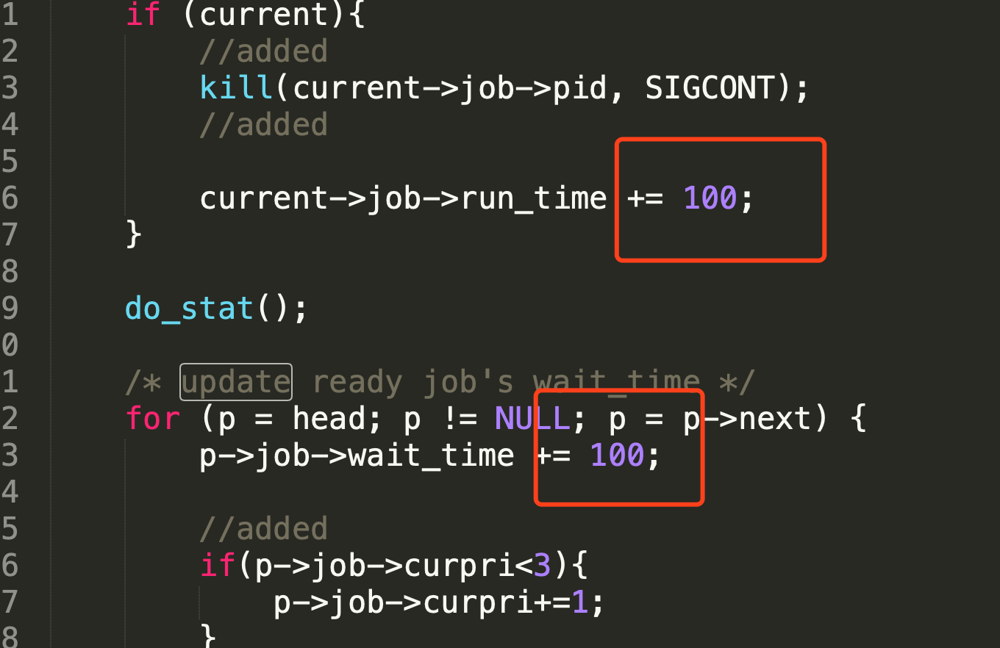

     4. Cycles exist in the waiting queue(in **jobselect()**)

        When a job is selected, we should let the property `next` of this job be `null`. Otherwise, if this job is selected to run and re-input to the waiting queue, there will be a cycle.

        **Before**

        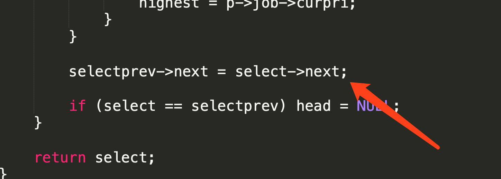

        **After**

        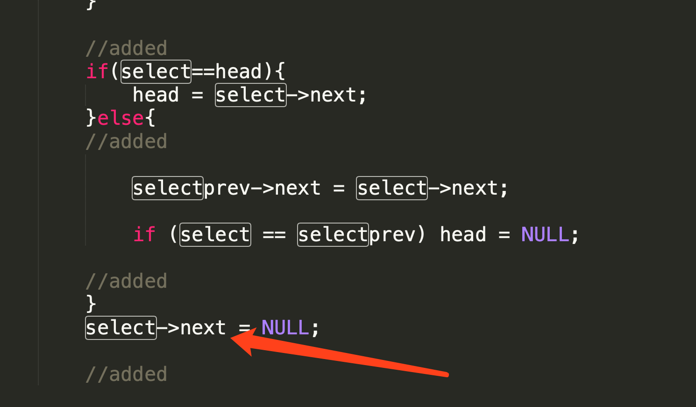

     5. Missing Head(in **jobselect()** and **do_deq()** )

        If the selected job is the head of the waiting queue, the new head should be `head->next`.

        **Before**

        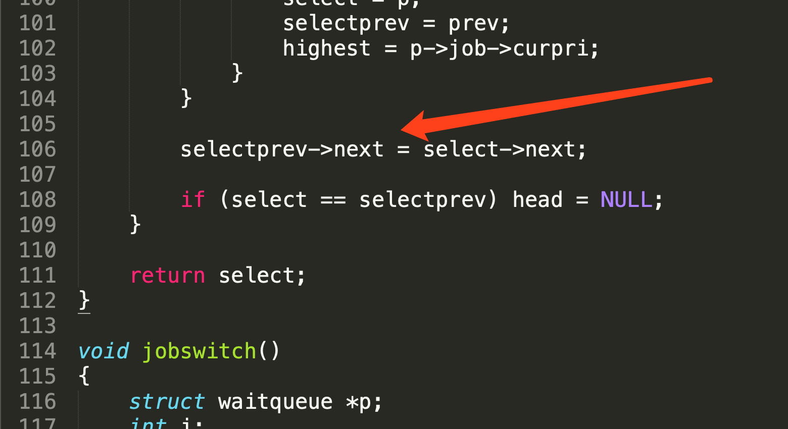

        **After**

        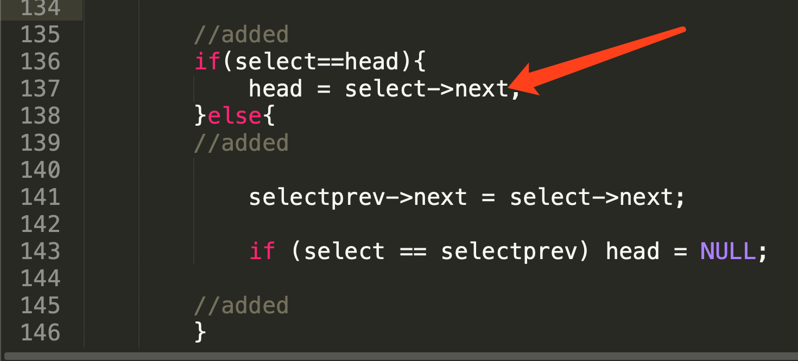

     6. Ignored Signal(in **updateall()**)

        The current job is not running in some cases, but it still occupies the current job position. So I send **SIGCONT** signal per 100 ms.

        **Before**

        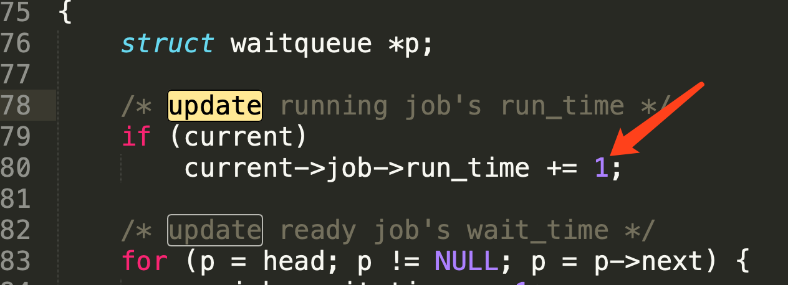

        **After**

        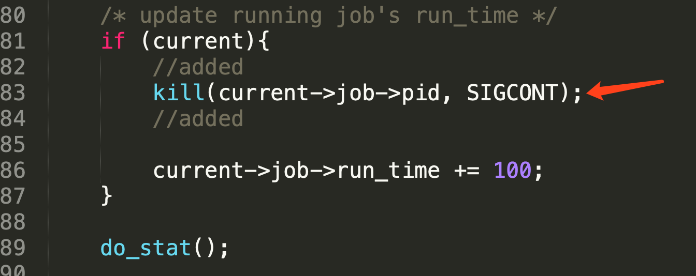

     7. limited range of selecting a candidate job(in **jobselect()**)

        The current process should also be considered as a candidate, because there are some times that the current job is the job with the highest priority. Additionall, the waiting time should be considered.

        **Before**

        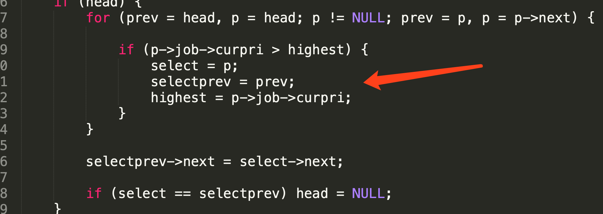

        **After**

        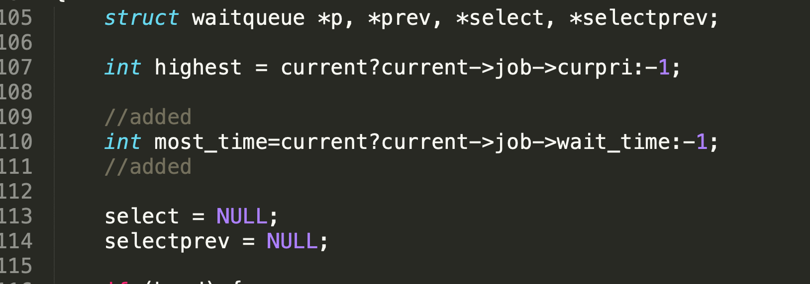

        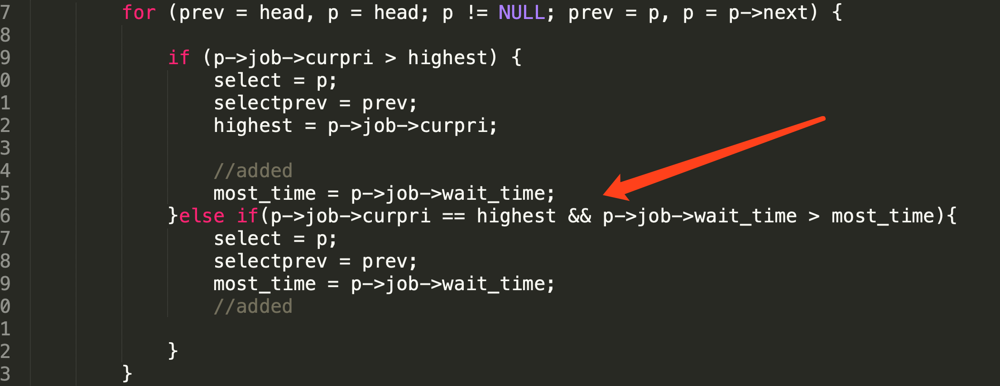

- **Run the job scheduler program and analyze the execution of the submitted job:**

  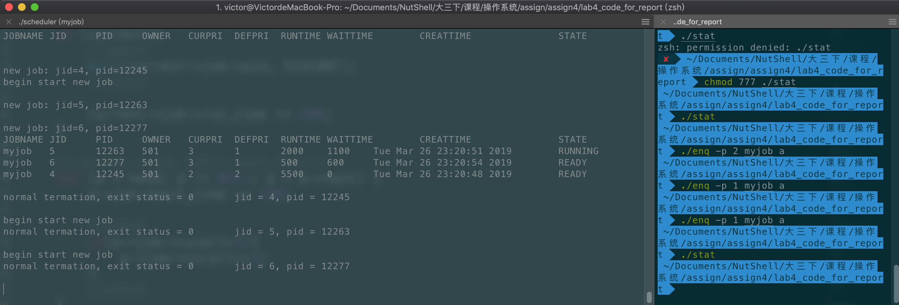

  1. Submit 3 jobs whose priorities are 2, 1 ,and 1.
  2. The job with higher priority should run first while the other's priority increases.
  3. Jobs start to switch and run recursively.

  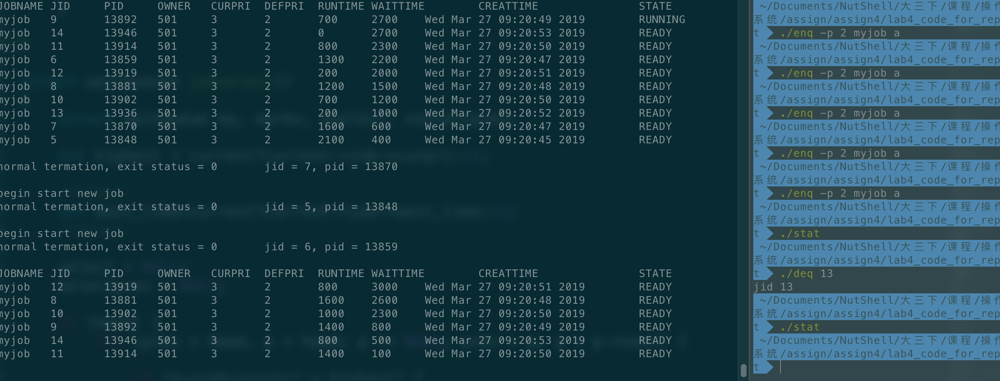

  1. Submit some jobs.
  2. Do dequeue.
  3. The job is dropped and the other jobs keep running or waiting.

- **Understand the process of job scheduling: (Execution results and corresponding code)**

    - Submit a new job

    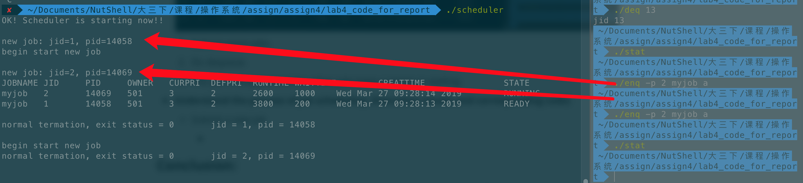

    When a job is submitted to CPU, it will be added to waiting queue at first(in **do_enq()**). Then all jobs in waiting queue will be checked in the next time slice(in **jobselect()**). 

    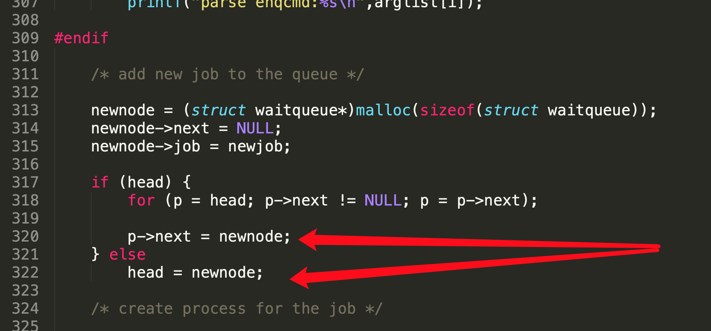

    The the selected job will be removed from the waiting queue and replace the current running job.(in **jobswitch()**)


    - End of job execution
    
        The running job will change to state `DONE`, and remain the current job position empty until the next time slice. This is implemented by handling signals and checking the current job every time slice.(in **jobswitch() and sig_handler()**).
    
        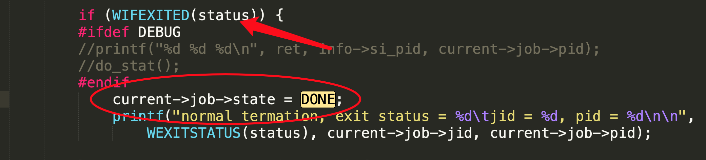
    
        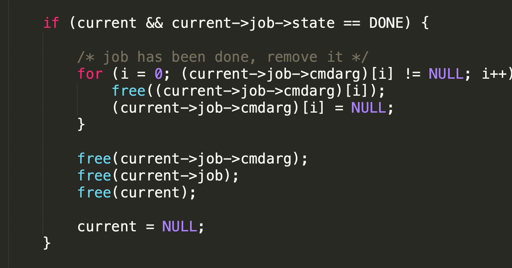


    - Job scheduling due to Priority
    
        It will check the priority of every job no matter where they are and update their priority per 100 ms.(in **updateall()**)
    
        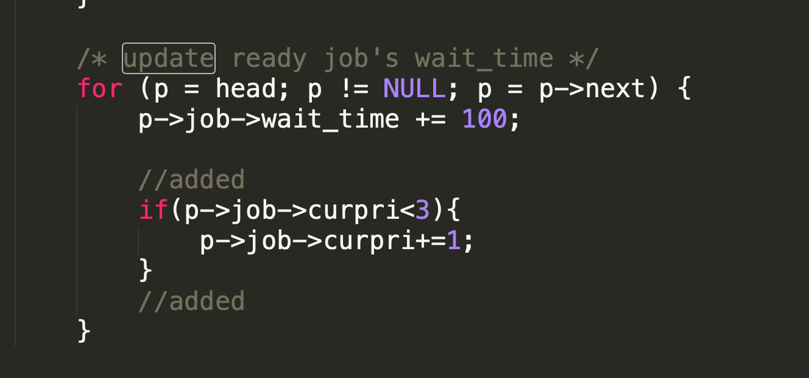
    
        When it comes to select a candidate job, CPU will do the selection due to jobs', including the current job's and waiting jobs', priority and waiting time(in **jobselect()**).
    
        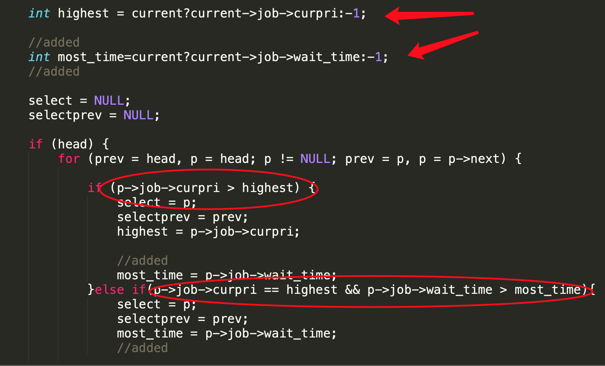
    
        Finally, the replaced job will be set to its default value and added to the waiting queue(in **jobswitch()**).
    
        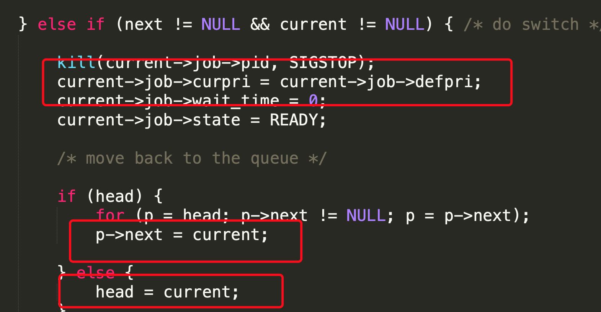
    
    - Job scheduling due to time slice
    
        The jobs with the same priority will be scheduled according to their waiting time.
    
        


### Conclusion:

In this assignment, I got familiar with the basic flow of processes scheduling according to both priority and waiting time. I obtained the knowledge about job switch and arrangement.
