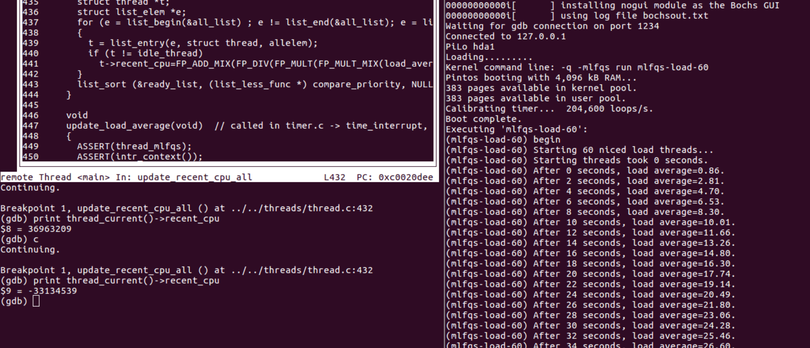

# SUSTech CS302 OS Project1 Final Report

#### Title:      Pintos                                                  

#### Student: 徐逸飞 11611209

#### Time:    2019/04/09

#### Experimental Environment:  1. Ubuntu 16.04 2. pintos

####Tasks:

>	*Task 1: Efficient Alarm Clock
>	Task 2: Priority Scheduler
>	Task 3: Multi-level Feedback Queue Scheduler (MLFQS)
>	Task 4: Test Pintos with GDB*

# Task 1: Efficient Alarm Clock

### Algorithms

​    When call `timer_sleep()`, I put the current thread to sleep by calling `thread_block()`, which makes the current thread unable to be scheduled again, and set the `ticks_blocked` of the current thread to an appropriate number. Then because `timer_interrupt()` is executed per second, every thread's `ticks_blocked`  whose value is not zero is checked and decreased by 1 and if it becomes zero, it will be awake and ready again. Then call `thread_yield()` to decide which thread should be run next.

### Comparison and Analysis

1. No change in algorithm compared with the design report. Frankly, this task is relatively easier than others. But I find the function `foreach()` operates on the `all_list`, which stores all threads no matter what status they are. So it can be imroved by maintaining another list called `block_list` to store the blocked threads. And once the time interruption occurs, we can iterate the `block_list` to speed up the program. 

   

2. This section was implemented on 25th, March. So I think I was not pushed by ddl in this part. 

   

3. There are some things to be improved -the implementation of `list_remove()` and `list_insert()` . The `list_insert()` prevent the same element from being inserted two different lists.

   ```c
   void
   list_insert (struct list_elem *before, struct list_elem *elem)
   {
     ASSERT (is_interior (before) || is_tail (before));
     ASSERT (elem != NULL);
   
     elem->prev = before->prev;
     elem->next = before;
     before->prev->next = elem;
     before->prev = elem;
   }
   ```

   When a `list_elem` is inserted, the previous and next node of this element will be changed to new ones. So if this element is already in another list, this operation will break the structure of the original list by mixing two lists into one. Additionally, `list_remvoe()` is as follows.

   ```c
   struct list_elem *
   list_remove (struct list_elem *elem)
   {
     ASSERT (is_interior (elem));
     elem->prev->next = elem->next;
     elem->next->prev = elem->prev;
     return elem->next;
   }
   ```

   This functio is so brute force and break the link between `elem` and its neibors directly. And then both lists will be destroyed, thus rendering me difficulty on my `block_list` thought. 


# Task 2: Efficient Alarm Clock

### Comparison and Analysis

1. The basic algorithm is the same as that in the design review, using donation and priority scheduling to improve the performance.

2. Inspired by a blog, remembering the maximum priority among candidate threads by the lock structure rather than by threads themselves, I used a recursive way to implement donation.

   ```c
   void lock_donate_recursively(struct thread* t,struct lock *lock){
     if(!lock)
       return;
     if(!lock->holder)
       return;
     if(t->priority < lock->max_priority)
       return;
   
     lock->max_priority = t->priority;
     thread_donate(lock->holder);
     lock_donate_recursively(t,lock->holder->requiring_lock);
   }
   ```

   ```c
   bool thread_donate(struct thread *t){
   	enum intr_level old_level = intr_disable (); // gurantee an atomic operation
   	thread_refresh (t); // update the priority of a thread
   	list_sort(&ready_list,thread_compare,NULL);
   	intr_set_level (old_level);
   }
   ```

3. This part is finished on 5st April.


# Task 3: Multi-level Feedback Queue Scheduler (MLFQS)

### Comparison and Analysis

1. This part is based on three formulas, calculating new priority, recent cpu and load average. The most important bug I encountered was the same as the bug in Task4, the overflow of float point number in pintos' way. So I will demonstrate the details of this bug in Task 4.

2. This part is finshed on 9th April. And I was pushed by ddl in this part. QwQ.


# Task 4: Test Pintos with GDB

**Find the bug** 

According to the error log, the load average is too large. Initially, I think it may be the wrong formulas. Unfortunately, the answer is not. And I think bug may result from calculation steps rather than formulas themselves. Follows are my 

 `load_avg = (59/60)× load_avg + (1/60) × ready_threads`.

1. the **load_avg** is related to the previous **load_avg** and **ready_thread**. So the most likely bug is due to **ready_thread**. 
2. **ready_thread** is the number of threads that are either running or ready to run at time
   of update so that it is related to the scheduleing of threads. 
3. Additionally, the scheduling depends on threads' priority, calculating from recent cpu and niceness, and the calculation uses `fixed_t`.
4. Furthermore, **recent_cpu** also uses `fixed_t`.
5. By hints, the most probable reason is the storage of float point number. The `fixed_t` is an integer actually. The 16 LSB are used for fractional part. So the most integer value it can represent is $2^{16}-1​$ (65535), which is stored in16 RSB. So what I should do is to check which calculation step is wrong.

6. The calculation of priority is unlikely to be wrong because of the limitation of max prioriy. And every temparary calculation is no larger than **recent_cpu**.
7. The calculation of load maybe cause the overflow, calculating `load_avg * 59` instead of `load_avg ÷ 60` at first. But after my modification, the problem still remained.
8. The calculation of recent_cpu may be overflow, calculating `(2 × load_avg) × recent_cpu` at first. After changing the order of calculation, the bug disappeared.

Above all, the calculation of `(2 × load_avg) × recent_cpu` caused the overflow of the floating point.

I added `printf` function in both `get_load_avg` and `update_load_average` to see the output at these two points.

```c
void
update_load_average(void)  // called in timer.c -> time_interrupt, called each second
{
  ASSERT(thread_mlfqs);
  ASSERT(intr_context());
  size_t ready_list_size = list_size (&ready_list);
  if (thread_current() != idle_thread)  // running or ready, not include idle thread
    ready_list_size++;
  load_average = FP_DIV_MIX( FP_ADD ( FP_MULT_MIX (load_average , 59), FP_CONST (ready_list_size)), 60);
  // print information when updating load average
  printf("thread %d setting\n",thread_current()->tid );
  printf("load average is %d\n", load_average);
}
```

```c
int
thread_get_load_avg (void) 
{
  // print information when getting load average
	printf("thread %d getting\n",thread_current()->tid );
  printf("load average is %d\n", load_average);
  
  return FP_ROUND(FP_MULT_MIX(load_average, 100));
}
```




​	The above diagram illustrates the wrong recent cpu because of the overflow.


And the output. The analysis is in comment.

>(mlfqs-load-60) After 0 seconds, load average=0.86.
>
>thread 18 setting
>load average is 120928
>thread 43 setting
>load average is 184448
>thread 1 getting
>load average is 184448
>(mlfqs-load-60) After 2 seconds, load average=2.81.
>
>… //omit the details
>
>thread 46 setting
>load average is 1851046
>thread 26 setting
>load average is 1885731
>thread 1 getting
>load average is 1885731
>(mlfqs-load-60) After 38 seconds, load average=28.77.
>
>**// I think the wrong recent cpu renders some threads wrong priorities. And the thread with wrong high priority is preemptive. So the operation getting the new load average is put off and get a wrong value.** 
>
>thread 7 setting
>load average is 1919838
>thread 57 setting
>load average is 1953376
>thread 37 setting
>load average is 1987448
>thread 47 setting
>load average is 2020952
>thread 27 setting
>load average is 2053897
>thread 12 setting
>load average is 2086293
>thread 62 setting
>load average is 2118149
>thread 42 setting
>load average is 2149474
>thread 52 setting
>load average is 2180277
>thread 32 setting
>load average is 2210567
>thread 17 setting
>load average is 2240352
>thread 22 setting
>load average is 2269641
>thread 7 setting
>load average is 2298441
>thread 57 setting
>load average is 2326761
>thread 37 setting
>load average is 2354609
>thread 47 setting
>load average is 2381993
>thread 27 setting
>load average is 2408921
>thread 12 setting
>load average is 2435400
>thread 12 setting
>load average is 2461438
>thread 36 setting
>load average is 2487042
>thread 23 setting
>load average is 2512219
>thread 55 setting
>load average is 2536976
>thread 1 getting
>load average is 2536976
>(mlfqs-load-60) After 40 seconds, load average=38.71.
>
>thread 1 getting
>load average is 2536976
>(mlfqs-load-60) After 42 seconds, load average=38.71.
>
>
>thread 1 getting
>load average is 2536976
>(mlfqs-load-60) After 44 seconds, load average=38.71.
>
>thread 1 getting
>load average is 2536976
>(mlfqs-load-60) After 46 seconds, load average=38.71.
>
>
>thread 1 getting
>lothread 1 setting
>load average is 2495785
>ad average is 2536976
>(mlfqs-load-60) After 48 seconds, load average=38.08.
>
>thread 1 getting
>load average is 2495785
>(mlfqs-load-60) After 50 seconds, load average=38.08.
>
>
>thread 1 getting
>load average is 2495785
>(mlfqs-load-60) After 52 seconds, load average=38.08.
>
>
>thread 1 getting
>load average is 2495785
>(mlfqs-load-60) After 54 seconds, load average=38.08.
>
>
>thread 1 getting
>load average is 2495785
>(mlfqs-load-60) After 56 seconds, load average=38.08.
>
>
>thread 1 getting
>load average is 2495785
>(mlfqs-load-60) After 58 seconds, load average=38.08.
>thread 1 setting
>load average is 2455280
>
>
>thread 1 getting
>load average is 2455280
>(mlfqs-load-60) After 60 seconds, load average=37.46.
>
>
>thread 1 getting
>load average is 2455280
>(mlfqs-load-60) After 62 seconds, load average=37.46.
>
>
>… // omit the details


# Reference

https://www.cnblogs.com/laiy/p/pintos_project1_thread.html

https://blog.csdn.net/learner_slc/article/details/79922342

https://github.com/Hindol/pintos